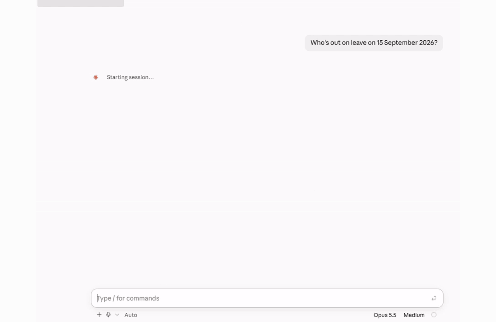

# OpenHR

[](https://github.com/Attri-Inc/open-hr/actions/workflows/ci.yml)
[](LICENSE)
[](https://www.python.org/)

**Local-first HR system of record, queryable by humans and agents.**

SQLite-backed people database. MCP server with 31 tools. Leave as a balance
ledger that cannot be overdrawn, single-holder asset custody, append-only audit log.

Part of a family of local-first agent services: open-crm (memory) · openwatch
(observability) · openledger (money) · **openhr (people)**.

The reference UI is the [OpenHR Portal](https://openhr-portal.vercel.app); this
repository is the system of record behind it.

---

## See it in action



---

## Quick Start

```bash
cd open-hr
python3 -m venv .venv && source .venv/bin/activate
pip install -r requirements.txt
```

`data/openhr.db` ships with the repo, already seeded with the demo company, so
it runs straight after cloning. To reset it — or after changing the schema:

```bash
python scripts/seed.py            # deletes and rebuilds data/openhr.db
```

### Connect from Claude Desktop / Code

```bash
python run_mcp.py                 # stdio transport (default)
```

For Claude Code:
```bash
claude mcp add openhr -s user -- \
  /absolute/path/to/open-hr/.venv/bin/python \
  /absolute/path/to/open-hr/run_mcp.py
```

See [docs/claude-connector.md](docs/claude-connector.md) for the full setup.

---

## Architecture

```
                ┌─────────────────────────────────────────┐
                │           SQLite people DB              │
                │  employees · leave_entitlements ·       │
                │  leave_requests · assets ·              │
                │  asset_assignments · documents ·        │
                │  requisitions · candidates · interviews │
                │  exits · exit_clearance · holidays ·    │
                │  audit_log · org_settings               │
                └────────────────────┬────────────────────┘
                                     │
                                     ▼
                     MCP server — 31 tools, reads + safe writes
                     stdio  ·  streamable-http /mcp :8792  ·  sse
                                     │
                                     ▼
                           Claude Desktop, Claude Code,
                           Cowork (remote), agent frameworks
```

### Project structure

A layered architecture (SOLID): the transport, business rules, and persistence
are separated, and each depends only on the layer's abstraction — not its
implementation. Swapping SQLite for Postgres later touches only `repositories/`
and `container.py`.

```
src/
├── domain/          pure constants, policy-as-data, date helpers, typed errors (no I/O)
├── infrastructure/  Database connection, Unit of Work, id/clock helpers
├── repositories/    protocols.py  — narrow Reader/Writer contracts
│                    sqlite.py     — the only code that writes SQL (aiosqlite)
├── services/        directory · leave · assets · recruitment · offboarding ·
│                    reports (Strategy) · records · audit · query
│                    — the only layer with business rules / invariants
├── days.py          half-day unit formatting  ·  money.py  paise / LPA formatting
├── serialization.py response/error envelope helpers
├── container.py     composition root — wires SQLite repos into services
└── mcp_server.py    thin MCP transport adapter over the services
run_mcp.py           stdio entry point for Claude Desktop / Code
scripts/             seed.py (demo company) · schema.sql · smoke_test.py
tests/               service-level tests of the core invariants
```

Querying is **raw parameterized SQL over `aiosqlite`** (no ORM); all SQL lives
behind the repository protocols, so services never see a query.

### Core invariants

1. **Leave is a balance ledger.** Days are integer **half-day units**
   (`UNITS_PER_DAY = 2`); money is integer minor units (paise); rates are integer
   basis points. No floats anywhere.
2. **A request reserves balance the moment it is raised.** `pending` and
   `approved` both consume; `declined` and `cancelled` release. Approving moves
   no balance — the reservation already happened — so double-spending a bucket is
   structurally impossible. A tracked type can never be overdrawn, and nobody can
   hold two overlapping live requests.
3. **History is append-only.** A decided leave request is never rewritten;
   corrections are a cancellation that leaves the original visible. Returning an
   asset closes its assignment row rather than deleting it, so "who had this
   laptop in March" stays answerable.
4. **An asset has exactly one holder at a time** — enforced by a partial unique
   index in the schema *and* checked in the service, so the caller gets a
   sentence instead of an `IntegrityError`.
5. **Lifecycles are state machines.** Employment status, leave status and
   candidate stage each move only along declared edges; an illegal move is
   refused with the list of legal ones.
6. **Exits gate on reality.** `assets_returned` cannot be ticked while the person
   still holds kit — the checklist reads the custody table, not a self-reported
   flag — and the employee becomes `exited` only when every step is signed off,
   dated on the last working day recorded up front.
7. **Every mutation writes an audit row in the same DB transaction** as the
   change it describes.

### MCP tools (31)

| Group | Tools |
|---|---|
| Directory | `list_employees` · `get_employee` · `get_org_chart` · `create_employee` · `update_employment_status` |
| Leave | `get_leave_balance` · `list_leave_requests` · `get_leave_calendar` · `request_leave` · `decide_leave_request` · `cancel_leave_request` · `grant_leave_entitlement` |
| Assets | `list_assets` · `get_employee_assets` · `assign_asset` · `return_asset` |
| Recruitment | `list_requisitions` · `list_candidates` · `get_candidate` · `advance_candidate` |
| Exits | `list_exits` · `get_exit_checklist` · `initiate_exit` · `complete_exit_step` |
| Reports | `get_headcount_report` · `get_attrition_report` · `get_leave_liability_report` |
| Records | `list_employee_documents` · `list_holidays` · `get_audit_log` |
| Escape hatch | `run_query` (SQL `SELECT` only) |

### Configuration

| Env var | Default | Notes |
|---|---|---|
| `OPENHR_DB` | `./data/openhr.db` | SQLite path |
| `MCP_TRANSPORT` | `stdio` (via `run_mcp.py`) | `stdio`, `streamable-http` (served at `/mcp`), or `sse` |
| `MCP_HOST` | `127.0.0.1` | HTTP transports only — loopback by default, deliberately |
| `MCP_PORT` | `8792` | HTTP transports only |

---

## Example questions to ask Claude

- "Who's out today?"
- "How much earned leave does Dev have left?"
- "Book Dev two days casual leave on 22–23 Oct for a family function."
- "Approve Tanvi's Goa leave as Fatima."
- "What kit is Karan still holding, and is he cleared to leave?"
- "How many people per department, and what was attrition this year?"
- "What's our leave liability on the books?"

---

## Contributing & License

Contributions welcome — see [CONTRIBUTING.md](CONTRIBUTING.md) and our
[Code of Conduct](CODE_OF_CONDUCT.md). Report vulnerabilities per [SECURITY.md](SECURITY.md).

Licensed under the **Apache License 2.0** — see [LICENSE](LICENSE).
